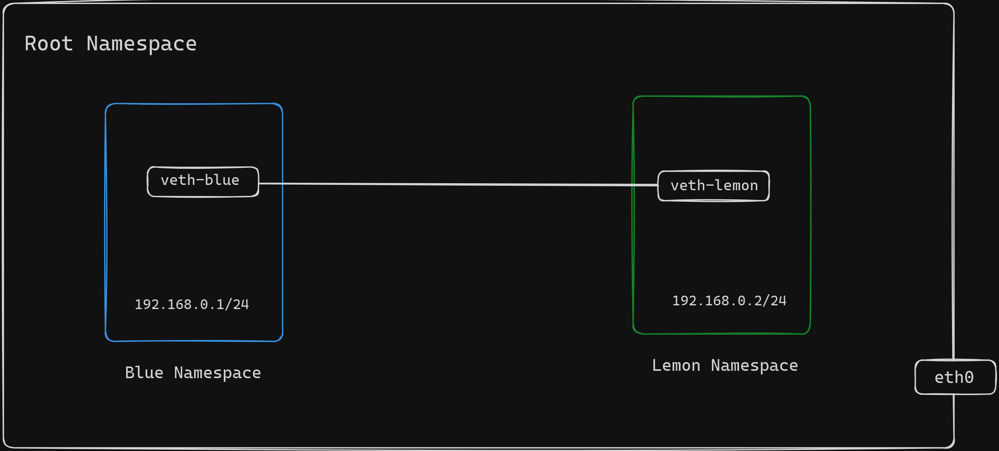

# CONNECT TWO CUSTOM NETWORK NS

## IP Forwarding 

IP forwarding in the Linux kernel refers to the ability of the kernel to route packets between different network interfaces. When IP forwarding is enabled, the Linux kernel acts as a router, forwarding packets from one network interface to another based on routing table entries.

To enable IP forwarding in the Linux kernel, you typically use the sysctl utility to modify the kernel parameters. Here's how you can enable IP forwarding temporarily:

```bash
sudo sysctl -w net.ipv4.ip_forward=1
```

This command sets the value of the net.ipv4.ip_forward parameter to 1, enabling IP forwarding for IPv4 traffic. To make this change persistent across reboots, we can edit the /etc/sysctl.conf file and add or uncomment the following line:

```bash
net.ipv4.ip_forward=1
```

Then, reload the sysctl settings:

```bash
sudo sysctl -p
```

Once IP forwarding is enabled, the Linux kernel will forward packets between network interfaces according to its routing table. This allows the Linux system to act as a router, forwarding traffic between different networks.

## Setting up Virtual Network between Namespaces



1. Creates two namespaces named blue-namespace and lemon-namespace.
2. Creates a virtual Ethernet link pair consisting of veth-blue and veth-lemon at root namespace.
3. Set the cable as NIC named veth-blue and veth-lemon.
4. Assign IP Addresses to the Interfaces.
5. Set the veth-blue and veth-lemon interfaces up, enabling them to transmit and receive data.
6. Set the default routes within each namespace, allowing them to route network traffic.

## Test Connectivity

Use these commands to test the connectivity between the namespaces by pinging each other's IP address.

```bash
# ping from blue-namespace
sudo ip netns exec blue-namespace ping 192.168.0.2
```

```bash
# ping from lemon-namespace
sudo ip netns exec lemon-namespace ping 192.168.0.1
```

## Clean Up 

Delete the namespaces in order to clean up the setup.

```bash
# delete namespaces
sudo ip netns del blue-namespace
sudo ip netns del lemon-namespace
```

