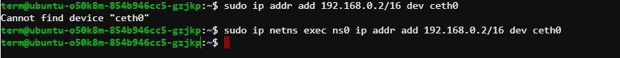

# EGRESS TRAFFIC

"Egress traffic" refers to network traffic that is leaving or exiting a network or network segment. In other words, it's the data packets that are being transmitted from a source within a network to a destination outside of that network.

We cannot connect to Google DNS using the private ip of the namespace. So, we have to change the firewall rules in order to allow all traffic to pass through the br0 interface without any restrictions.  

```bash
sudo iptables -t nat -A POSTROUTING -s 192.168.0.0/16 -j MASQUERADE
```

-t nat : Specifies the table to which the rule should be added. In this case, it's the NAT (Network Address Translation) table.

-A POSTROUTING : Appends the rule to the POSTROUTING chain of the specified table.

-s 192.168.0.0/16 : Specifies the source IP address range for which the rule should apply. In this case, it's the entire subnet 192.168.0.0/16.

-j MASQUERADE : Specifies the action to take if the packet matches the criteria defined in the rule. In this case, it's MASQUERADE, which means to masquerade (i.e., rewrite) the source IP address of the packets to match the IP address of the outgoing interface.

## Steps

1. Create a custom network namespace and a bridge.
2. Configure a bridge interface.
3. Configure virtual ethernet cable.
4. Assign an ip address to the created namespace and turn loopback interface into UP state.
5. Add a Default Gateway in the route table.
6. Namespace to root ns Communication using ping.
7. Change a SNAT (source NAT) rule of the IP table in order to modify the POSTROUTING chain.
8. Ping 8.8.8.8 from ns0 namespace.

## Faced Problems



```bash
sudo ip addr add 192.168.0.2/16 dev ceth0
```
This command cannot get "ceth0" because "ceth0" is not configured in the network instead it is configured to namespace. As a result, we have to execute this command in the created "ns0" namespace. 

So, the command should be:

```bash
sudo ip netns exec ns0 ip addr add 192.168.0.2/16 dev ceth0
```

This command adds the IP address 192.168.0.2/16 to the ceth0 interface, but it does so within the network namespace named ns0. It uses the ip netns exec command to execute the ip addr add command within the ns0 network namespace. This ensures that the IP address is added to the ceth0 interface within the specified network namespace.