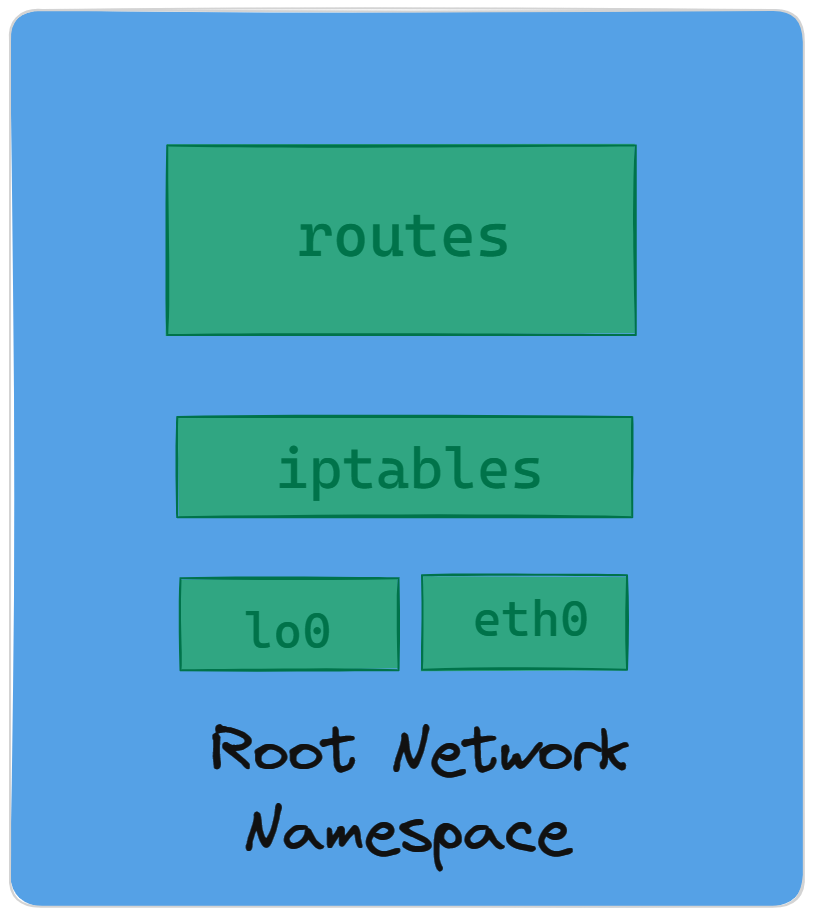

# NETWORK NAMESPACE INSPECTING

The Network namespace isolates the system’s physical network from the virtual network namespace within a single system. Each network namespace has its own interfaces, routing tables, forwarding rules, etc. Processes can be launched and dedicated to one network namespace.



## Routes

Routes determine how network traffic is directed. In a network namespace, we can set up routes to control how traffic flows between different interfaces. For example, we might want to route traffic destined for a specific subnet through a particular interface or gateway.To add routes within a network namespace, we typically use the "ip route add" command. For instance:

```bash
ip netns exec <namespace> ip route add <destination> via <gateway> dev <interface>
```

## Iptables

iptables is a powerful firewall utility in Linux that allows us to define rules to filter or manipulate network traffic. Within a network namespace, we can configure iptables rules to control traffic between different interfaces, including lo (loopback) and eth0 (physical Ethernet).For example, to allow traffic between lo and eth0, we might use the following iptables rules:

```bash
# Allow traffic from lo to eth0
iptables -A FORWARD -i lo -o eth0 -j ACCEPT
```

## Loopback Interface (lo)

 The loopback interface is a virtual network interface that allows communication within the same host. It's commonly used for local inter-process communication and network testing.

 In a Linux network namespace, the loopback interface behaves similarly to the default namespace. It provides local connectivity within the namespace itself, allowing applications and services running within the namespace to communicate with each other using the loopback address.

 ## Physical Ethernet Interface (eth0)

 Physical Ethernet interfaces are hardware interfaces used to connect a Linux system to an Ethernet network. They allow the system to communicate with other devices on the network.

 Each physical Ethernet interface can be assigned one or more IP addresses, depending on the network configuration. These IP addresses are used to uniquely identify the interface on the network and facilitate communication with other devices. IP addresses can be assigned statically (manually) or dynamically (via DHCP).

 ## Learnings
 1. Understood how to create custom network namespace.
 2. Different commands related to network namespace.


