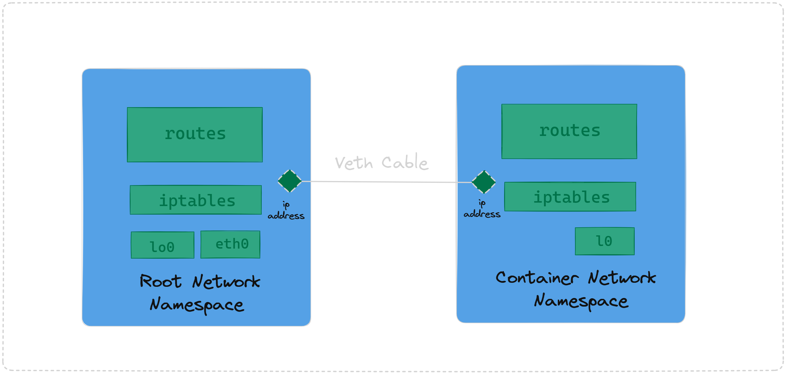

# CONNECT NETWORK NS TO HOST

### Steps to connect Namespace to Host

1. Create a custom namespace
2. Create virtual ethernet devices using veth cable inside the root namespace.
3. Move one end of the veth cable to the created namespace.
4. Configure IP Addresses to both end of this veth cable and turn up the      interfaces.
5. Add a route to explicitly tell the system about the route for sending traffic.
6. Try to ping the created ns from the veth-host interface and vice versa.