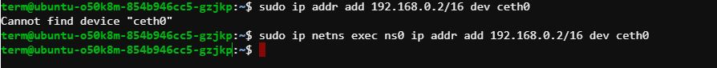

# CONNECT NETWORK NS TO ROOT

## Steps

1. Create a custom network namespace and a bridge.
2. Configure a bridge interface.
3. Configure virtual ethernet cable.
4. Assign an ip address to the created namespace and turn loopback interface into UP state.
5. Add a Default Gateway in the route table.
6. Namespace to root ns Communication using ping.

## Faced Problems



```bash
sudo ip addr add 192.168.0.2/16 dev ceth0
```
This command cannot get "ceth0" because "ceth0" is not configured in the network instead it is configured to namespace. As a result, we have to execute this command in the created "ns0" namespace. 

So, the command should be:

```bash
sudo ip netns exec ns0 ip addr add 192.168.0.2/16 dev ceth0
```

This command adds the IP address 192.168.0.2/16 to the ceth0 interface, but it does so within the network namespace named ns0. It uses the ip netns exec command to execute the ip addr add command within the ns0 network namespace. This ensures that the IP address is added to the ceth0 interface within the specified network namespace.