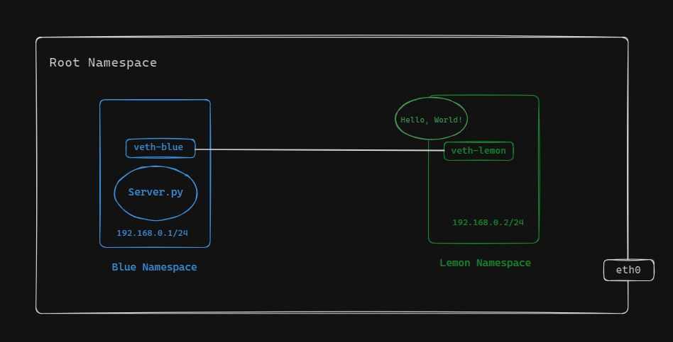

# PROCESS COMMUNICATION BETWEEN NAMESPACES

This guide outlines the steps to create two namespaces named blue-namespace and lemon-namespace, and establish a virtual Ethernet network between them using veth interfaces. The goal is to enable communication between the namespaces and process. Besides allowing them to ping or curl from one namespace to process.


## Communicating between process and different namespaces.



1. Creates two namespaces named blue-namespace and lemon-namespace.
2. Creates a virtual Ethernet link pair consisting of veth-blue and veth-lemon at root namespace.
3. Set the cable as NIC named veth-blue and veth-lemon.
4. Assign IP Addresses to the Interfaces.
5. Set the veth-blue and veth-lemon interfaces up, enabling them to transmit and receive data.
6. Set the default routes within each namespace, allowing them to route network traffic.
7. Create a server inside one namespace and ping or curl from another namespace.

## Curl from another namespace

First we need to enter inside the blue-namespace and run the server.py file.

```bash
sudo ip netns exec blue-namespace /bin/bash
```
Run the server.py application.

```bash
source venv/bin/activate
python3 server.py
```

Now let's get into lemon namespace and curl the application.

```bash
sudo ip netns exec lemon-namespace /bin/bash
```
Run the curl command.

```bash
curl -v http://192.168.0.1:3000
```
By following these steps and ensuring network connectivity between the namespaces, we were able to use curl from another namespace to access the "Hello, World!" output from the Flask server running in the server.py file.


