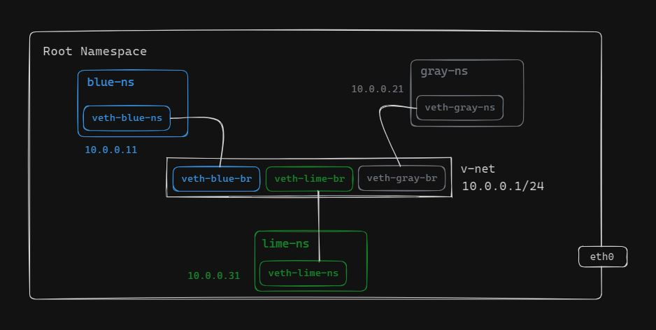

# BRIDGE NETWORKING AMONG NAMESPACES

This guide outlines the steps to create three namespaces named blue-ns, gray-ns and lime-ns. Then establish a linux bridge network among them using veth interfaces. The goal is to enable communication among the namespaces and allow them to ping each other.

## Bridge Networking

Bridge networking in Linux involves creating a network bridge that allows multiple network interfaces to operate as a single network segment. This is commonly used in virtualization environments, containerization, or when connecting multiple physical or virtual machines together.

In the context of Linux namespaces, bridge networking involves creating a virtual bridge interface within a network namespace to connect multiple network interfaces or containers together within the same namespace. This allows isolated network communication between containers or network namespaces while still utilizing the host's network infrastructure.

Once the bridge interface is created within the namespace, we can add network interfaces to it. These network interfaces can be virtual Ethernet pairs (veth pairs), physical interfaces, or other types of network interfaces. By connecting multiple network interfaces to the bridge interface, we create a network segment within the namespace.

## Setting up Linux Bridge Network among Namespaces



1. Create a Linux bridge interface 'v-net'.
2. Make the bridge interface up.
3. Assign an IP address to the bridge interface 'v-net'.
4. Create three network namespaces named blue-ns, gray-ns and lime-ns.
5. Create three virtual Ethernet pairs for connecting the namespaces with the bridge.
6. Move each end of veth cable to a different namespace and add the other end of the virtual interfaces to the bridge.
7. Set the bridge and namespace interfaces up.
8. Assign IP addresses to the virtual interfaces within each namespace and set the default routes.
9. Add firewall rules to enable traffic to travel across the v-net virtual bridge.

## Test Connectivity

Use these commands to test the connectivity between the namespaces by pinging each other's IP address.

```bash
# Ping lime-ns to the blue-ns
sudo ip netns exec lime-ns ping -c 2 10.0.0.11
```
```bash
# Ping blue-ns to the lime-ns
sudo ip netns exec blue-ns ping -c 2 10.0.0.31
```
```bash
# ping gray-ns to the blue-ns
sudo ip netns exec gray-ns ping -c 2 10.0.0.11
```

## Clean Up

Remove the namespaces and bridge network device run these commands to clean up the setup.

```bash
sudo ip netns del <namespace>
sudo ip link delete <bridge network name> type bridge
```
